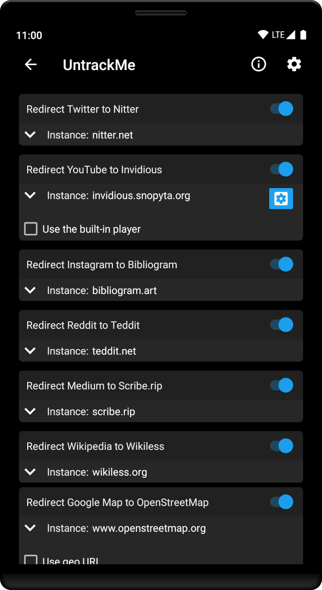
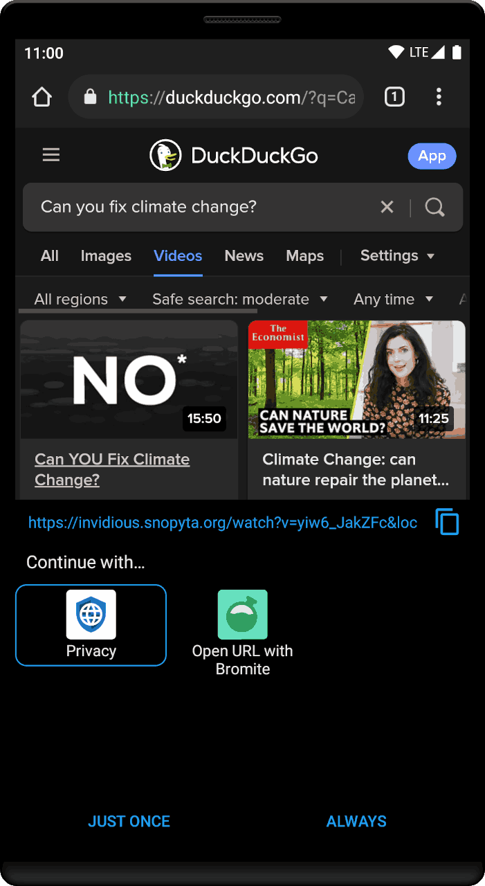
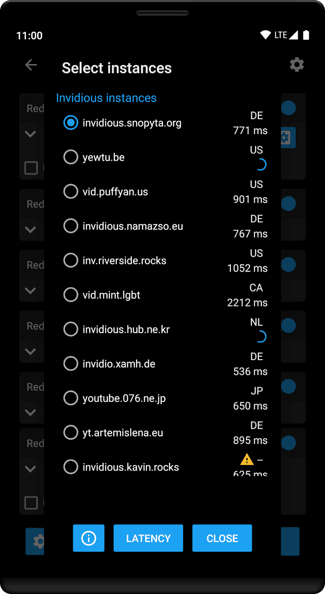
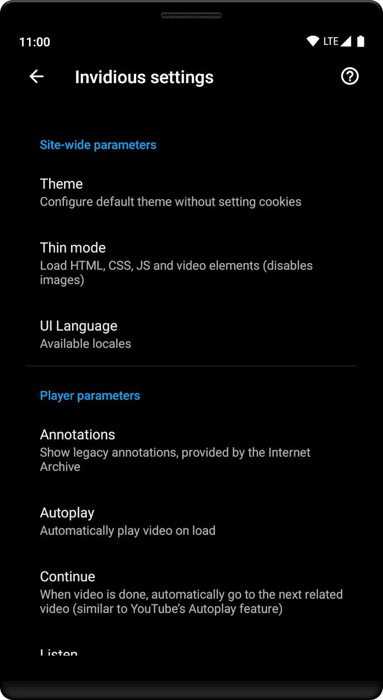

# UntrackMe    

UntrackMe transforms Twitter, YouTube, Instagram, Reddit and Medium and Wikipedia links to links of open source, [privacy friendly front-ends](#privacy-friendly-front-ends). Converts Google Maps links to OpenStreetMap links. Removes tracking parameters from any url. Then delegates the action to other apps that are capable of handling them.

##### Versions of UntrackMe:
- **Lite** 
Can handle Twitter, YouTube, Instagram, Reddit Medium, Wikipedia, Google Maps and shortened urls.

- **Full** 
All features of _Lite_ version + Can remove tracking parameters from any url.

## Donate

## Download

- **Full Version**: 

- **Lite Version**: 

## Privacy Friendly Front-Ends

- **Nitter** 
Nitter is a free and open source front-end for Twitter 
_Source Code: [github.com/zedeus/nitter](https://github.com/zedeus/nitter)_

- **Invidious** 
Invidious is a free and open source front-end for YouTube 
_Source Code: [github.com/iv-org/invidious](https://github.com/iv-org/invidious)_

- **Bibliogram** 
Bibliogram is a free and open source front-end for Instagram 
_Source Code: [sr.ht/~cadence/bibliogram](https://sr.ht/~cadence/bibliogram)_

- **Teddit** 
Teddit is a free and open source front-end for Reddit 
_Source Code: [codeberg.org/teddit/teddit](https://codeberg.org/teddit/teddit)_

- **Libreddit** 
Libreddit is a free and open source front-end for Reddit 
_Source Code: [github.com/spikecodes/libreddit](https://github.com/spikecodes/libreddit)_

- **Scribe** 
Scribe is a free and open source front-end for Medium 
_Source Code: [sr.ht/~edwardloveall/scribe](https://sr.ht/~edwardloveall/scribe)_

- **Wikiless** 
Wikiless is a free and open source front-end for Wikipedia 
_Source Code: [codeberg.org/orenom/wikiless](https://codeberg.org/orenom/wikiless)_

### Screenshots:

### Going further

#### Privacy Redirect

A web extension from [@SimonBrazell](https://github.com/SimonBrazell) that redirects Twitter, YouTube, Instagram & Google Maps requests to privacy friendly alternatives - Nitter, Invidious, FreeTube, Bibliogram & OpenStreetMap.

Source code of [Privacy Redirect](https://github.com/SimonBrazell/privacy-redirect)

#### Deprecated / Archived

For a full coverage with URLs, you can use FireFox with the [Invidition](https://addons.mozilla.org/fr/firefox/addon/invidition/) plugin from [@booteille](https://framapiaf.org/@booteille).

Source code of [Invidition on Codeberg](https://codeberg.org/Booteille/invidition)